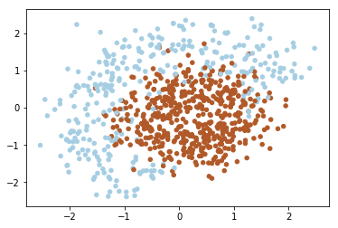
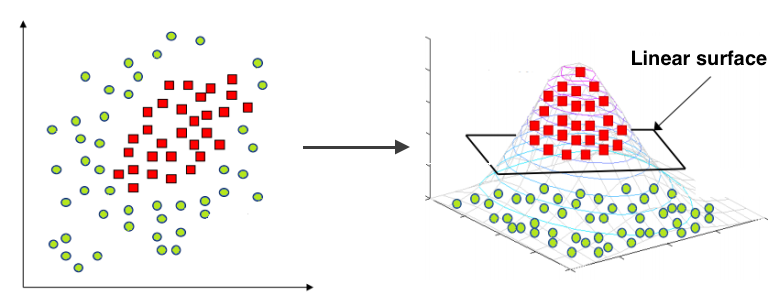
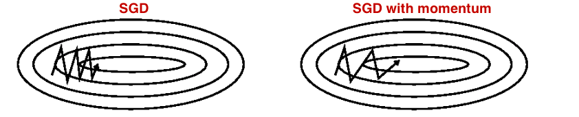

# Linear classifier

### Linear models are basic building blocks for many deep architectures, and stochastic optimization is used to learn models.

In [Linear models and optimization Jupyter Notebook](https://github.com/MingalievDinar/machine-learning/blob/master/linear-models/Linear%20models%20and%20optimization.ipynb) implemented a linear classifier. It is trained using stochastic gradient descent modifications and numpy.

Precisly, there is solved a 2D classification problem with synthetic data.

As you can notice the data above isn't linearly separable. Since that we should add features (or use non-linear model). Note that decision line between two classes have form of circle, since that we can add quadratic features to make the problem linearly separable. The idea under this displayed on image below:

### Logistic regression

To classify objects we will obtain probability of object belongs to class '1'. To predict probability we will use output of linear model and logistic function.
 
In logistic regression the optimal parameters are found by cross-entropy function minimization.

Since we train our model with gradient descent, we should compute gradients. To be specific, we need a derivative of loss function (cross-entropy) over each weight.

### Training

We use the gradient of Loss function to train our classifier using stochastic gradient descent.

### Mini-batch SGD

Stochastic gradient descent just takes a random example on each iteration, calculates a gradient of the loss on it and updates weights. Such learn technic is very volatile. To make the process more stable we can use Mini-batch - averaging loss on small sub-sample.

### SGD with momentum

Momentum is a method that helps accelerate SGD in the relevant direction and dampens oscillations as can be seen in image below. It does this by adding a fraction [alpha] of the update vector of the past time step to the current update vector.

### RMSprop

RMSPROP algorithm uses squared gradients to adjust learning rate.
